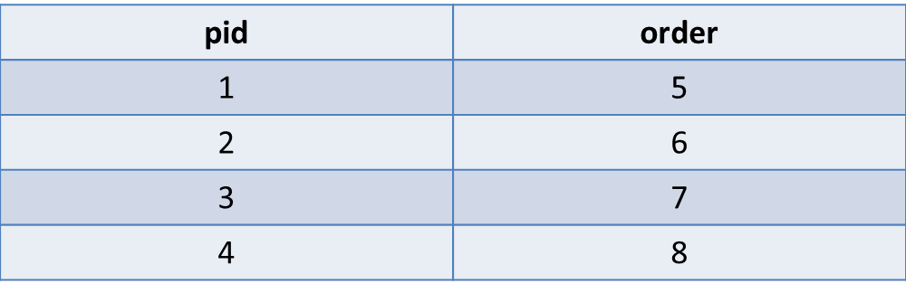
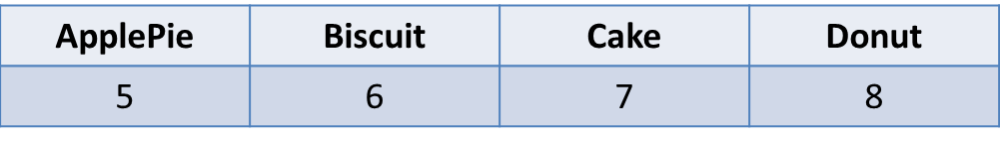

# 行列轉換
```bash
相關詞
#pivot, #row to column
```
##問題概述
將一列一列的資料轉換成以欄位顯示的表格

>
>

>

```sql
SELECT 
  MAX(IF(pid=1, order, 0)) ApplePie,
  MAX(IF(pid=2, order, 0)) Biscuit,
  MAX(IF(pid=2, order, 0)) Cake,
  MAX(IF(pid=2, order, 0)) Donut,
FROM
  myTable
```

