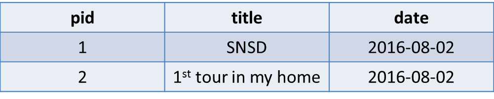
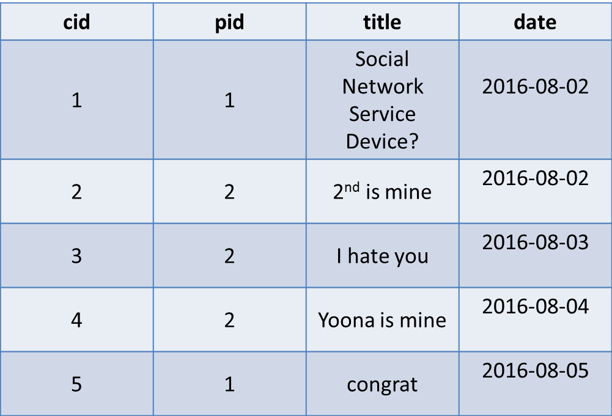

# 計算每篇文章的回應數量


```bash
#相關詞
#likes, #comments, #somethinglikethat
```


---


##問題概述
通常每篇文章都會有很多回應，這篇介紹的就是如何針對每篇文章去統計它的回應數量
因為這邊還會用到`LEFT JOIN`方法，比較複雜，為了方便大家理解，就把全部的資料表都畫出來囉～
(表1+表2+表3→表4)


表1：post



表2：comment



表3：c


表4：結果
---


  
##Query語法

```sql
SELECT 
  p.*, c.*
FROM
  post p
LEFT JOIN
  (SELECT 
     pid,
     COUNT(*) AS `count`
   FROM
     comment
   GROUP BY
     pid) c
ON
  c.pid = p.pid

```


---

##範例解析
有沒有！本篇也用到了之前所介紹過的範例：計算單一值出現次數  
所以重點在於資料表的`LEFT JOIN`使用