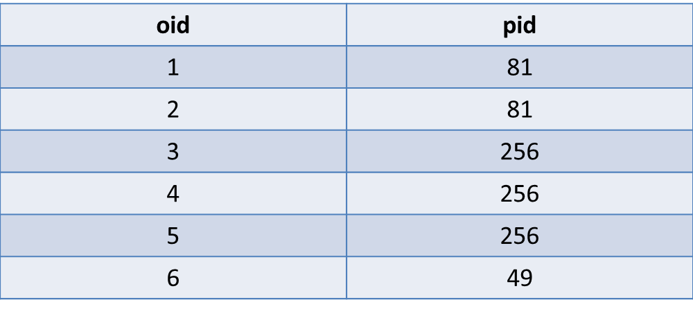
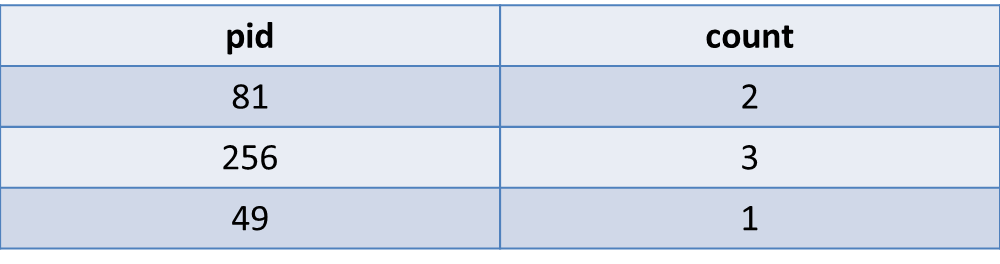

# 計算單一值出現次數
```bash
#相關詞
#occurrence, #times, #groupbysaygoodbye
```


---


##問題概述
找出資料表中相同的值出現的次數  
或是換句話說，在一欄位中，相同值的資料筆數(表1→表2)


表1：myTable


表2：結果



---


  
##Query語法

```sql
SELECT 
  pid,
  COUNT(pid) AS `count`
FROM
  myTable
GROUP BY
  pid
```


---

##範例解析
在SELECT的最後記得用`GROUP BY`來把多餘的欄位去掉，  
不然會看到很多相同的結果唷！