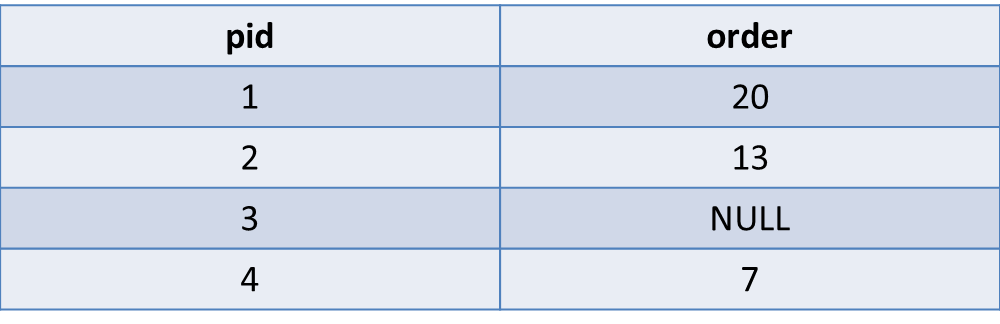
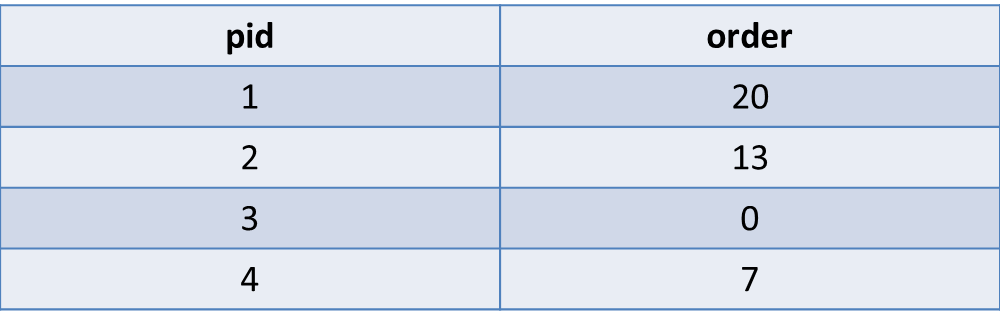

# 將NULL替代為0

```bash
#相關詞
#NULL, #replace, #0, #zero
```


---


##問題概述
將欄位中本來是NULL的欄位轉為0(表1→表2)


表1：myTable


表2：結果



---


  
##Query語法

```sql
SELECT 
  pid,
  COALESCE(order, 0) AS order
FROM
  myTable
```


---

##範例解析
```
COALESCE(order, 0)
```
COALESCE(參數1, 參數2)方法會檢查參數1是否為NULL，  
如果為NULL，即返回參數2的值  
所以這個方法也可以應用在返回其他數字