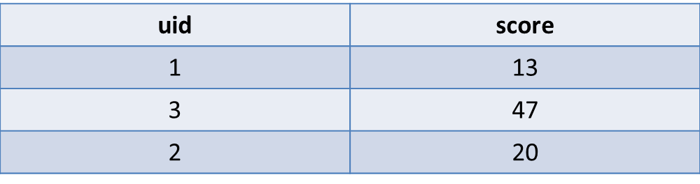
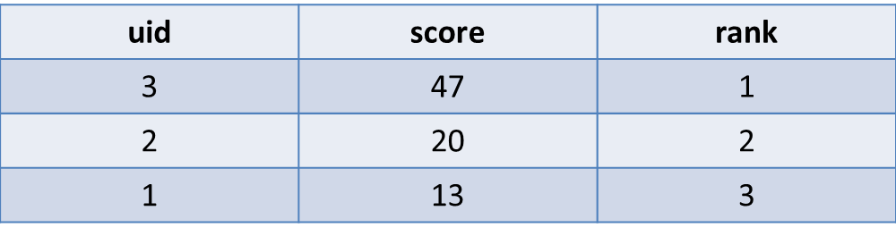

# 計算排名

```bash
#相關詞
#ranking, #not, #with, #tie
```


---


##問題概述
根據欄位中數值大小來計算排名(表1→表2)


表1：myTable


表2：結果



---


  
##Query語法

```sql
SELECT
  uid,
  score,
  @currentRank := @currentRank + 1 AS rank
FROM
  myTable, (SELECT @currentRank := 0 ) r
ORDER BY
  rank DESC
```


---

##範例解析
這一篇的範例比較難一點，因為有牽涉到SQL中的變數指定  
如果有學過php的話，`@currentRank`就等於`$currentRank`，是個使用者定義的變數  
還記得`x = x + 1`中的`=`不等於數學中的等於嗎？（希望你聽得懂這個繞口令在說什麼）
程式語言中的`=`普遍是指向、或參考(reference)的意思，我個人是覺得比較適合用「→」來理解
用數學的方式來說，就是將等號右邊的值代入等號左邊
而由於在SQL中`=`被用來檢查條件，所以指定變數的符號就變成了`:=`囉  
